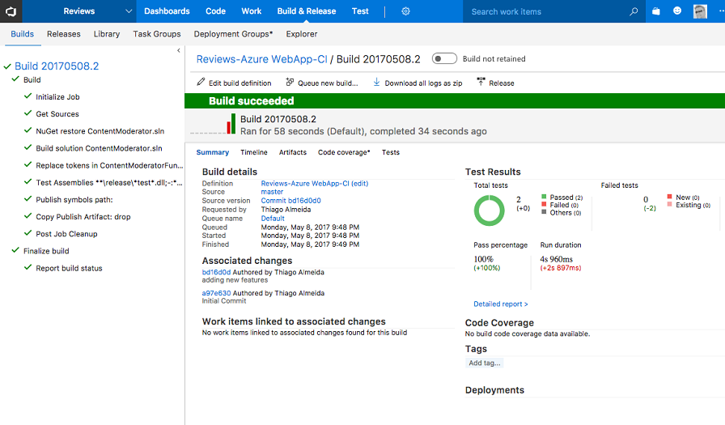
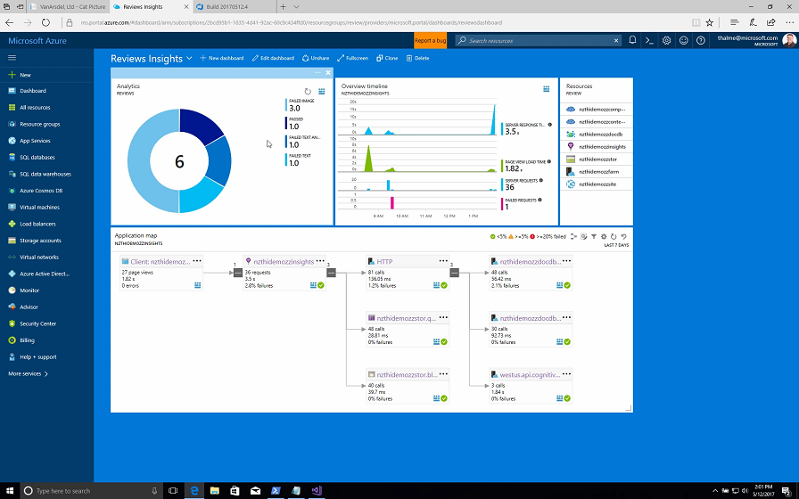

<a name="HOLTitle"></a>
# Provision Customer Reviews Services and Reset datas#

---

<a name="Overview"></a>
## Overview ##

Azure Resource Manager helps automate the provisionning of a lot of resources in Azure.

In this lab, you will create the needed Azure Services for to run CustomerReviews web site and his automatic moderation with Cognitives Services. You will also add images to populate CustomerReviews site.

<a name="Objectives"></a>
### Objectives ###

In this hands-on lab, you will learn how to:

- Create a Continuous Deployment of an Azure Function
- Use a custom telemetry for Application Insights 

<a name="Prerequisites"></a>
### Prerequisites ###

The following are required to complete this hands-on lab:

- An active Microsoft Azure subscription. If you don't have one, [sign up for a free trial](http://aka.ms/WATK-FreeTrial).
- An active GitHub account. If you don't have one, [sign up for free ](https://github.com/join). 
- Execute succesfully the [lab 01](../00 - Provision resources and Reset) .

---

<a name="Exercises"></a>
## Exercises ##

This hands-on lab includes the following exercises:

- [Exercise 1: Create an VSTS account and Project)](#Exercise1)
- [Exercise 2: Fork GitHub repo](#Exercise2)
- [Exercise 3: Create a pipeline to Continuous Delivery of an Azure Function](#Exercise3)
- [Exercise 4: Create custom query and dashboard with Application Insights](#Exercise4)

Estimated time to complete this lab: **30** minutes.

<a name="Exercise1"></a>
## Exercise 1: Create an Azure Cloud Shell (PowerShell) ##

The first step in .... In this exercise, you will create .....

1. Open the [Azure Portal](https://portal.azure.com) in your browser. If asked to log in, do so using your Microsoft account.

2. Click **Cloud Shell** button on top of page

    

    > A banner appear on the back of web page 

3. Click **PowerShell (Windows)**

    

4. Select your subscription, and Click on **Create storage**. This will create a new storage account for you and create a file share to persist files.

    

5. Your Cloud Shell be ready in a few minutes .

    

The Azure Cloud Shell is a windows container. A new one will be started with your CloudDrive mapped as a volume. And you will be connected to your Azure current subscription. has been created and you have added three containers to the storage account created for it. The next step is to get code from this repo.

TODO: sample: 1. Repeat Step 7 to add containers named "accepted" and "rejected" to blob storage.
TODO: next exercises

<a name="Exercise2"></a>
## Exercise 2: Fork GitHub repo ##

Once you have created an Azure Cloud Shell, you can you can use Powershell, commands, and some other SDK or application installed on it. In this exercise, you will clone the git repo into a persistent volume _CloudDrive_ . This will allow you to get all the scripts necessary to create the Azure Services. 

1. Type these commands to navigate to your CloudDrive and clone this git repository.

    > Copy and paste in Azure Cloud Shell
    >
    > - Windows: `Ctrl-insert` to copy and `Shift-insert` to paste. Right-click dropdown can also enable copy/paste.
    >   - FireFox/IE may not support clipboard permissions properly.
    > - Mac OS: `Cmd-c` to copy and `Cmd-v` to paste. Right-click dropdown can also enable copy/paste.

    ```powershell
    cd C:\users\ContainerAdministrator\CloudDrive
    git clone --depth 1 --single-branch https://github.com/azugfr/functions-customer-reviews.git
    ```

    > _-depth 1 --single-branch_ options will limit download to the tip of master branch. The full history will not be downloaded. 

    

    ​

2.  Type this command to navigate inside the repo and list content.  

    ```powershell
    cd .\functions-customer-reviews\
    ls
    ```

    


TODO: An Azure Function written in C# has been created, complete with a JSON project file containing information regarding project dependencies. The next step is to add an application setting that the Azure Function relies on.

<a name="Exercise3"></a>
## Exercise 3: Create a pipeline to Continuous Delivery of an Azure Function ##

TODO: The Azure Function you created in [Exercise 2](#Exercise2) loads a subscription key for the Microsoft Cognitive Services Computer Vision API from application settings. This key is required in order for your code to call the Computer Vision API, and is transmitted in an HTTP header in each call. In this exercise, you will subscribe to the Computer Vision API, and then add an access key for the subscription to application settings.

TO detail

You can also create a VSTS build definition to trigger from a code commit. To get it set up, follow these instructions: 

- Use an existing VSTS account or [create a new one](https://www.visualstudio.com/en-us/docs/setup-admin/team-services/sign-up-for-visual-studio-team-services)
- [Make sure you have Colin's ALM Corner Build & Release Tools installed on your VSTS account](https://marketplace.visualstudio.com/items?itemName=colinsalmcorner.colinsalmcorner-buildtasks)
- [Create a Personal Access Token (PAT)](https://www.visualstudio.com/en-us/docs/setup-admin/team-services/use-personal-access-tokens-to-authenticate) and save the value.
- Create a new Build Definition as documented in [this blog post](https://blogs.msdn.microsoft.com/appserviceteam/2017/06/01/deploying-visual-studio-2017-function-projects-with-vsts/) using your GitHub fork as the source
- Create the following variables for your new build definitions:
    - AzureWebJobsStorage
    - MicrosoftVisionApiKey
    - ContentModerationApiKey
    - customerReviewDataDocDB
    - APPINSIGHTS_INSTRUMENTATIONKEY
- Add the `Replace Tokens` task between the `Build Solution` and `Test Assemblies` tasks. This task will replace the values in `local.settings.json` with the values in the variables. Configure the settings in this task with the following values:
    - sourcePath: ContentModeratorFunction/bin/$(BuildConfiguration)
    - filePattern: local.settings.json
    - tokenRegex: __(\\w+)__
- Queue a new build run - the build summary should show the two tests passed:



TODO:The work of writing and configuring the Azure Function is complete. Now comes the fun part: testing it out.

<a name="Exercise4"></a>
## Exercise 4: Create custom query and dashboard with Application Insights ##

TODO: Your function is configured to listen for changes to the blob container named "uploaded" that you created in [Exercise 1](#Exercise1). Each time an image appears in the container, the function executes and passes the image to the Computer Vision API for analysis. To test the function, you simply upload images to the container. In this exercise, you will use the Azure Portal to upload images to the "uploaded" container and verify that copies of the images are placed in the "accepted" and "rejected" containers.

1. In the Azure Portal, go to the resource group created for your Function App. Then click the storage account that was created for it.

    

    _Opening the storage account_

2. Click **Blobs** to view the contents of blob storage.

    

    _Opening blob storage_

TO detail:

This section highlights how Application Insights custom telemetry can be surfaced on Azure along with overall telemetry from the demo website.

| Screen                         | Steps                                    | Script                                   |
| ------------------------------ | ---------------------------------------- | ---------------------------------------- |
|                                | Point out in the code the ``EmitCustomTelemetry`` call.<p>Show the ``EmitCustomTelemetry`` method code.<p>Change to Azure Portal tab in the browser | In addition to the best development tooling and great integration with Visual Studio Team Services, we can take advantage of Application Insights to easily build custom telemetry into my application. You will see that with a few lines of code I am collecting and storing application telemetry for deep insights and analysis. So let's switch to the Azure Portal to see this in action against our production website. |
|  | (in the shared Reviews Insights dashboard) Mouse over the donut wheel.<p>Hover over a couple of areas of the donut.<p>Hover over the application map.<p>Click on edit query in the donut or tab to already opened tab | When we go to the Azure portal we have rich visualizations and deep insights about how my app and my function are performing in a shared dashboard used by my team. For example I can see how many Reviews have been approved or rejected and why. I can also see how many calls are being made to my site, Azure Function, and their dependencies, and the latency of these calls. And if I need to I can drill into the specifics of my telemetry using Application Insights Analytics |
|  | Change the type of query result to ``barchart``<p>Click Go to run the query again. | Here I can drill in to individual requests, aggregate my results in a different way. I can change the view type and re-run the query. I can export it to our Azure Portal dashboard as you saw, or use this as a source in Power BI.<p>So, with Azure Functions, Visual Studio, Team Services, and App Insights you and your team have the best tooling for creating, deploying and monitoring serverless solutions. Now go install the latest Azure Functions support for Visual Studio and create your serverless solutions! Thank you |

TODO:  The presence of seven images in the "accepted" container and one in the "rejected" container is proof that your Azure Function executed each time an image was uploaded to the "uploaded" container. If you would like, return to the BlobImageAnalysis function in the portal and click **Monitor**. You will see a log detailing each time the function executed.


<a name="Summary"></a>
## Summary ##

In this hands-on lab you learned how to:

- Create Azure Services with Azure Resource Manager templates
- Execute PowerShell and Command srcipts in Azure Cloud Shell
- Use Azure Web Apps and deployment engine (Kudu) to automate build and deploy of a Web site from a GitHub repo.

This is just one example of how you can leverage Azure Resource Managemeer and Azure Cloud Shell to automate infrastructure. Experiment with other Azure Resource Manager templates to learn more about Azure Services and provisionning to identify additional ways in which they can aid your research or business.

